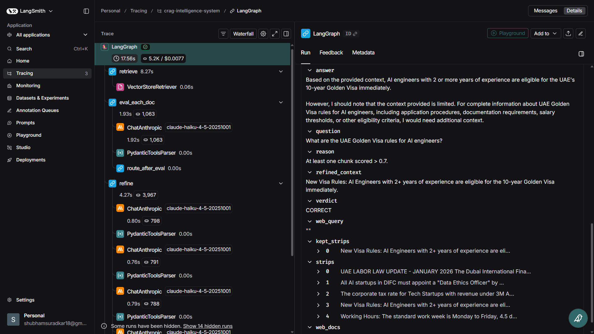
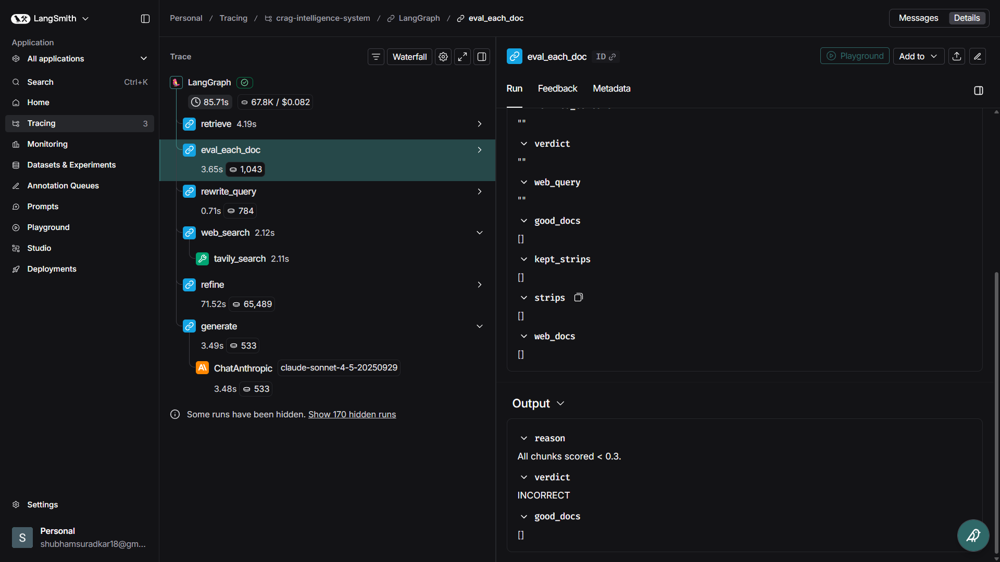

# CRAG Intelligence System

A production-grade **Corrective RAG** system built with LangGraph that actually knows when it doesn't know something — and goes looking for the answer instead of making things up.

[](https://github.com/ShubhammS18/crag-intelligence-system/actions)

---

## What This Is

Most RAG systems blindly trust whatever they retrieve. This one doesn't.

Before generating an answer, the system scores every retrieved chunk against the query. If the internal documents are good enough, it uses them. If they're weak or missing, it rewrites the query and searches the web. Then — regardless of which path it took — it decomposes all context into individual sentences and filters out anything that doesn't directly answer the question. Only the surviving relevant sentences reach the language model.

The result is a system that's grounded, honest about uncertainty, and measurably better than standard RAG — not just architecturally cleaner.

**Built as a corporate intelligence QA system** over UAE/DIFC regulatory documents, but the architecture works for any domain-specific knowledge base.

---

## Benchmark Results

Evaluated on 25 hand-crafted questions across all three CRAG decision paths using RAGAS. Here's how it compares to a standard naive RAG baseline:

| Metric | CRAG + Refine | Naive RAG | Delta |
|--------|:---:|:---:|:---:|
| Context Precision | 0.7428 | 0.2917 | **+45.1%** |
| Context Recall | 0.6533 | 0.5000 | **+15.3%** |
| Answer Correctness | 0.5652 | 0.4872 | **+7.8%** |
| Faithfulness | 0.8305 | 0.8857 | -5.5% |

The **+45.1% context precision** is the headline. The `eval_each_doc` grader filters out irrelevant chunks before they reach generation — naive RAG passes everything through. The faithfulness dip is expected and intentional: the hybrid web fallback introduces slightly messier context than clean internal documents, but the coverage gains across the other three metrics make it worthwhile.

> Full evaluation report: [`evaluation/results/benchmark_report.md`](evaluation/results/benchmark_report.md)

---

## Architecture

The system routes every question through one of three paths depending on how well the internal documents answer it.

```
[User Question]
      │
      ▼
  ┌─────────┐
  │ retrieve│  ← FAISS similarity search, top-4 chunks
  └─────────┘
      │
      ▼
┌──────────────┐
│ eval_each_doc│  ← Haiku scores each chunk 0.0–1.0
└──────────────┘
      │
      ├─── score > 0.7 (CORRECT) ──────────────────────┐
      │                                                 │
      └─── score < 0.3 (INCORRECT) ──┐                  │
      │                              │                  │
      └─── in between (AMBIGUOUS) ───┤                  │
                                     ▼                  │
                              ┌──────────────┐          │
                              │ rewrite_query│          │
                              └──────────────┘          │
                                     │                  │
                                     ▼                  │
                              ┌────────────┐            │
                              │ web_search │ ← Tavily   │
                              └────────────┘            │
                                     │                  │
                                     └────────┬─────────┘
                                              │
                                              ▼
                                        ┌────────┐
                                        │ refine │  ← sentence-level filter
                                        └────────┘    (Haiku, keep/drop per sentence)
                                              │
                                              ▼
                                        ┌──────────┐
                                        │ generate │  ← Sonnet, grounded answer
                                        └──────────┘
                                              │
                                              ▼
                                       [Answer + Verdict
                                        + Kept Sentences
                                        + Latency + Cost]
```

**Three paths, one refine node.** CORRECT uses internal docs only. INCORRECT uses web only. AMBIGUOUS uses both. All three converge at the refine node before generation.

---

## The Refine Node — Why It Matters

This is the part that makes the system actually work well, and it's worth explaining.

After retrieval (from FAISS, Tavily, or both), you typically have 4–10 document chunks containing hundreds of sentences. Most of those sentences are irrelevant — section headers, boilerplate, tangentially related content. Passing all of that to the LLM introduces noise that leads to hallucination or diluted answers.

The refine node breaks every chunk into individual sentences and asks Haiku a binary question for each one: *does this sentence directly help answer the question?* Only sentences that pass get joined into `refined_context`. Only `refined_context` reaches Sonnet for generation.

```
Raw chunks (messy, noisy)
         │
         ▼
  sentence decomposition
         │
         ▼
  ┌─────────────────────────────────────────┐
  │  "Engineers qualify for Golden Visa."   │  ← keep ✓
  │  "The sky is blue today."               │  ← drop ✗
  │  "Apply via the DIFC portal."           │  ← keep ✓
  │  "Section 4.2 of the regulations..."    │  ← drop ✗
  └─────────────────────────────────────────┘
         │
         ▼
  refined_context (clean, relevant only)
         │
         ▼
      generate
```

This is expensive — roughly 10–20 Haiku calls per request — but Haiku is cheap enough that a full request costs around $0.005–$0.015, which the API now returns in every response.

---

## Observability

Every graph execution is traced automatically in LangSmith. Each trace shows the full node-by-node path, token consumption per LLM call, latency per node, and the CRAG verdict assigned.

**Three traces to look at — one per path:**

| CORRECT Path | AMBIGUOUS Path | INCORRECT Path |
|:---:|:---:|:---:|
 |  |  |
| Internal docs sufficient | Hybrid internal + web | Full Tavily fallback |
| `docs → eval → refine → generate` | `docs → eval → rewrite → web → refine → generate` | `docs → eval → rewrite → web → refine → generate` |

Beyond LangSmith, the system logs every request to `request_log.jsonl` and exposes a `/metrics` endpoint that computes aggregated stats in real time:

```json
{
  "total_requests": 10,
  "success_rate": 1.0,
  "failure_rate": 0.0,
  "citation_coverage": 1.0,
  "latency_p50_ms": 9200,
  "latency_p95_ms": 28400,
  "avg_cost_usd": 0.008312,
  "verdict_distribution": {
    "CORRECT": 4,
    "AMBIGUOUS": 3,
    "INCORRECT": 3
  },
  "prompt_version": "v1.0.0"
}
```

---

## Prompts Are Versioned

All four prompts (doc evaluator, query rewriter, sentence filter, answer generator) live in `app/prompts.py` with a `PROMPT_VERSION` string following semver. The `/health` endpoint returns the active prompt version, making it easy to verify which prompts are deployed without looking at logs.

When a prompt changes, the version bumps. When the version bumps, git shows exactly what changed and when. Treat prompts like code — because they are.

---

## Tech Stack

| Layer | Tech |
|---|---|
| Orchestration | LangGraph, LangChain |
| LLM (grading + filtering) | Claude Haiku 4.5 |
| LLM (generation) | Claude Sonnet 4.5 |
| Vector store | FAISS (local, no server needed) |
| Embeddings | sentence-transformers/all-MiniLM-L6-v2 |
| Web search | Tavily |
| Observability | LangSmith + custom JSONL logger |
| Evaluation | RAGAS |
| API | FastAPI + Uvicorn |
| CI/CD | GitHub Actions |

---

## Quickstart

```bash
git clone https://github.com/YOUR_USERNAME/crag-intelligence-system
cd crag-intelligence-system

python -m venv venv
source venv/bin/activate        # Windows: venv\Scripts\activate

pip install -r requirements.txt

cp .env.example .env
# Fill in your keys: ANTHROPIC_API_KEY, TAVILY_API_KEY, LANGCHAIN_API_KEY

python ingest.py uae_data.txt

uvicorn app.api:app --reload
```

Open `http://localhost:8000/docs` for the interactive Swagger UI.

---

## API

**Ask a question:**
```bash
curl -X POST http://localhost:8000/ask \
  -H "Content-Type: application/json" \
  -d '{"question": "What are the Golden Visa rules for AI engineers in the UAE?"}'
```

```json
{
  "answer": "AI Engineers with 2+ years of experience are eligible for the 10-year Golden Visa immediately through DIFC.",
  "verdict": "CORRECT",
  "reason": "At least one chunk scored > 0.7.",
  "kept_strips": [
    "AI Engineers with 2+ years of experience are eligible for the 10-year Golden Visa immediately."
  ],
  "latency_ms": 8420,
  "estimated_cost_usd": 0.005814
}
```

**Check system health:**
```bash
curl http://localhost:8000/health
```

**Get aggregated metrics:**
```bash
curl http://localhost:8000/metrics
```

---

## Project Structure

```
crag-intelligence-system/
├── app/
│   ├── api.py              # FastAPI endpoints (/ask, /health, /metrics)
│   ├── config.py           # Pydantic settings, CRAG thresholds, model names
│   ├── models.py           # Request/response and structured output schemas
│   ├── prompts.py          # Versioned prompt registry (PROMPT_VERSION)
│   ├── request_logger.py   # JSONL request logger + metrics computation
│   └── graph/
│       ├── state.py        # GraphState TypedDict
│       ├── nodes.py        # All 6 node functions
│       ├── edges.py        # Conditional routing logic
│       └── graph.py        # StateGraph assembly and compilation
│   └── services/
│       ├── retriever.py    # FAISS loader and retriever
│       └── web_search.py   # Tavily search wrapper
├── evaluation/
│   ├── dataset.py          # 25 Q&A test pairs (8 CORRECT, 9 AMBIGUOUS, 8 INCORRECT)
│   ├── naive_rag.py        # Baseline system (retrieve → generate, no CRAG)
│   ├── run_eval.py         # CRAG-only RAGAS evaluation
│   ├── run_benchmark.py    # Full CRAG vs Naive RAG comparison
│   └── results/
│       ├── crag_results.json
│       ├── naive_rag_results.json
│       └── benchmark_report.md
├── tests/
│   ├── test_nodes.py       # Unit tests for eval_each_doc and refine nodes
│   └── test_api.py         # Integration tests for FastAPI endpoints
├── .github/workflows/
│   └── ci.yml              # GitHub Actions — pytest + smoke test on every push
├── ingest.py               # Document ingestion CLI
├── uae_data.txt            # Sample knowledge base (DIFC regulations)
└── .env.example            # Environment variable template (no real keys)
```

---

## Design Decisions

**Why CRAG over standard RAG?**
Standard RAG has no quality gate — it passes whatever it retrieves directly to generation, even if the retrieved content is completely irrelevant. CRAG adds a grading step that catches this before it causes hallucination. The +45.1% context precision improvement in the benchmark makes this concrete.

**Why sentence-level filtering instead of chunk-level?**
Chunks are coarse. A 300-word chunk might contain 2 relevant sentences and 15 irrelevant ones. Filtering at the chunk level keeps the noise. Filtering at the sentence level removes it. The cost is more Haiku calls; the benefit is cleaner context reaching generation.

**Why Haiku for grading and Sonnet for generation?**
Grading and sentence filtering are binary decisions that don't require strong reasoning — Haiku handles them at ~25x lower cost than Sonnet. Generation requires nuance and instruction-following — that's where Sonnet earns its cost.

**Why FAISS over a vector database like ChromaDB?**
FAISS is the right tool for this scale. A few hundred chunks from a focused document set doesn't need a server-based database. FAISS loads into memory from two local files, requires zero infrastructure, and is fast enough. In production with continuous ingestion and concurrent users, I'd migrate to Pinecone or Weaviate — but that's a different scope.

**Why RAGAS for evaluation?**
BLEU and ROUGE measure surface text overlap, not factual correctness. RAGAS measures faithfulness (are claims supported by context?) and answer correctness (is the answer semantically right?) — these are the metrics that matter to users. Running RAGAS on 25 questions before and after changes is the closest equivalent to proper ML model validation for a RAG system.

---

## Running the Evaluation

```bash
# CRAG system only
python -m evaluation.run_eval

# Full benchmark comparison
python -m evaluation.run_benchmark
```

Results are saved to `evaluation/results/`. The benchmark report is in markdown.

---

## Running Tests

```bash
pytest tests/ -v
```

Tests mock all LLM calls — no API credits consumed, no network required. CI runs this automatically on every push to main.

---

## Environment Variables

| Variable | Description |
|---|---|
| `ANTHROPIC_API_KEY` | Your Anthropic API key |
| `TAVILY_API_KEY` | Your Tavily search API key |
| `LANGCHAIN_API_KEY` | Your LangSmith API key |
| `LANGCHAIN_TRACING_V2` | Set to `true` to enable LangSmith tracing |
| `LANGCHAIN_PROJECT` | LangSmith project name |

Copy `.env.example` to `.env` and fill in your values. Never commit `.env` — it's blocked by `.gitignore`.

---

*Built by Shubham Suradkar | Stack: LangGraph · Claude · FAISS · Tavily · RAGAS · FastAPI*
